# Data Model — Tienda Mis Trapitos

## 1. Objetivo

Definir el modelo de datos lógico inicial para soportar el MVP del e-commerce.

No es todavía el schema final de Drizzle, pero sí la base conceptual y estructural para implementarlo sin improvisar. Y eso es CLAVE, porque improvisar en catálogo, precios e inventario después sale carísimo.

---

## 2. Decisiones de modelado

### 2.1 Identidad y autenticación

- Se reutiliza **Better Auth** como capa de autenticación.
- Las tablas de auth quedan como infraestructura.
- El dominio de negocio agrega perfiles separados para:
  - clientes;
  - usuarios internos.

### 2.2 Variantes primero

- El stock, el SKU y el precio viven en la **variante**, no en el producto padre.
- La variante se identifica por la combinación única de `product + size + color`.

### 2.3 Dinero

- Todos los importes deben almacenarse en **minor units** (`amount_in_cents` o equivalente entero).
- Nunca usar `float` para dinero. NUNCA. Eso después rompe conciliación y reporting.

### 2.4 Historial confiable

- Los pedidos guardan snapshots de nombre, SKU, talla, color y precio.
- El historial no debe depender del estado actual del catálogo.

### 2.5 Inventario auditable

- El inventario se modela con:
  1. **ledger de movimientos**;
  2. **balance materializado por variante y ubicación**.

### 2.6 Ubicaciones de stock

- Aunque MVP arranque con un solo depósito, conviene modelar `stock_locations` desde el inicio.
- Esto evita rediseñar inventario si mañana aparece un segundo depósito.

### 2.7 Pagos robustos

- Los pagos se relacionan a órdenes, pero los eventos del proveedor se guardan por separado para asegurar idempotencia y trazabilidad.

---

## 3. Convenciones recomendadas

- PKs técnicas: `uuid`.
- IDs de negocio legibles cuando apliquen: `order_number`, `sku`, `slug`.
- Timestamps en UTC: `created_at`, `updated_at`, `paid_at`, etc.
- Estados: enums de dominio o constrained text.
- Borrado lógico para catálogos y usuarios internos cuando aplique.

---

## 4. Diagrama conceptual

```mermaid
erDiagram
  AUTH_USERS ||--o| CUSTOMER_PROFILES : extends
  AUTH_USERS ||--o| STAFF_USERS : extends

  CATEGORIES ||--o{ PRODUCTS : groups
  PRODUCTS ||--o{ PRODUCT_IMAGES : has
  PRODUCTS ||--o{ PRODUCT_VARIANTS : has
  SIZES ||--o{ PRODUCT_VARIANTS : classifies
  COLORS ||--o{ PRODUCT_VARIANTS : classifies

  PRODUCT_VARIANTS ||--o{ VARIANT_PRICES : priced_by
  OFFERS ||--o{ OFFER_PRODUCTS : targets
  PRODUCTS ||--o{ OFFER_PRODUCTS : targeted
  OFFERS ||--o{ OFFER_VARIANTS : targets
  PRODUCT_VARIANTS ||--o{ OFFER_VARIANTS : targeted

  CUSTOMER_PROFILES ||--o{ CUSTOMER_ADDRESSES : owns
  CUSTOMER_PROFILES ||--o{ SALES_ORDERS : places
  SALES_ORDERS ||--o{ SALES_ORDER_ITEMS : contains
  SALES_ORDERS ||--o{ ORDER_ADDRESSES : snapshots
  SALES_ORDERS ||--o{ ORDER_STATUS_HISTORY : tracks
  SALES_ORDERS ||--o{ PAYMENT_TRANSACTIONS : paid_by
  SALES_ORDERS ||--o{ PAYMENT_WEBHOOK_EVENTS : receives

  STOCK_LOCATIONS ||--o{ INVENTORY_BALANCES : stores
  PRODUCT_VARIANTS ||--o{ INVENTORY_BALANCES : stocked_as
  STOCK_LOCATIONS ||--o{ INVENTORY_MOVEMENTS : affects
  PRODUCT_VARIANTS ||--o{ INVENTORY_MOVEMENTS : moves

  SUPPLIERS ||--o{ PURCHASE_ORDERS : receives
  PURCHASE_ORDERS ||--o{ PURCHASE_ORDER_ITEMS : contains
  PURCHASE_ORDERS ||--o{ PURCHASE_RECEIPTS : fulfilled_by
  PURCHASE_RECEIPTS ||--o{ PURCHASE_RECEIPT_ITEMS : details
  PRODUCT_VARIANTS ||--o{ PURCHASE_ORDER_ITEMS : requested
  PRODUCT_VARIANTS ||--o{ PURCHASE_RECEIPT_ITEMS : received
```

---

## 5. Entidades por dominio

### 5.1 Auth e identidad

#### Infraestructura de auth

Estas tablas serán administradas por Better Auth:

- `auth_users`
- `auth_sessions`
- `auth_accounts`
- `auth_verifications`

> El nombre exacto puede variar según Better Auth, pero el concepto es ese. El dominio de negocio NO debe acoplarse de forma caótica a esos detalles.

#### customer_profiles

| Campo | Tipo | Notas |
| --- | --- | --- |
| id | uuid | PK |
| user_id | uuid | FK a auth user, único |
| first_name | text | |
| last_name | text | |
| phone | text | nullable |
| is_active | boolean | default true |
| created_at | timestamptz | |
| updated_at | timestamptz | |

#### staff_users

| Campo | Tipo | Notas |
| --- | --- | --- |
| id | uuid | PK |
| user_id | uuid | FK a auth user, único |
| role | enum | `super_admin`, `admin_comercial`, `operador_inventario`, `compras`, `atencion_ventas` |
| is_active | boolean | default true |
| created_at | timestamptz | |
| updated_at | timestamptz | |

#### customer_addresses

| Campo | Tipo | Notas |
| --- | --- | --- |
| id | uuid | PK |
| customer_id | uuid | FK |
| label | text | casa, trabajo, etc. |
| recipient_name | text | |
| line_1 | text | |
| line_2 | text | nullable |
| city | text | |
| state | text | nullable |
| postal_code | text | |
| country_code | text | ISO-3166 |
| phone | text | nullable |
| is_default | boolean | |
| created_at | timestamptz | |

### 5.2 Catálogo

#### categories

| Campo | Tipo | Notas |
| --- | --- | --- |
| id | uuid | PK |
| parent_id | uuid | FK self nullable |
| name | text | |
| slug | text | único |
| description | text | nullable |
| is_active | boolean | |
| sort_order | integer | |
| created_at | timestamptz | |
| updated_at | timestamptz | |

#### products

| Campo | Tipo | Notas |
| --- | --- | --- |
| id | uuid | PK |
| category_id | uuid | FK |
| name | text | |
| slug | text | único |
| description | text | |
| brand | text | nullable |
| status | enum | `draft`, `active`, `archived` |
| is_featured | boolean | |
| created_at | timestamptz | |
| updated_at | timestamptz | |

#### product_images

| Campo | Tipo | Notas |
| --- | --- | --- |
| id | uuid | PK |
| product_id | uuid | FK |
| image_url | text | |
| alt_text | text | nullable |
| sort_order | integer | |
| is_primary | boolean | |

#### sizes

| Campo | Tipo | Notas |
| --- | --- | --- |
| id | uuid | PK |
| code | text | único (`S`, `M`, `L`, `36`, etc.) |
| label | text | |
| sort_order | integer | |
| is_active | boolean | |

#### colors

| Campo | Tipo | Notas |
| --- | --- | --- |
| id | uuid | PK |
| code | text | único interno |
| label | text | |
| hex | text | nullable |
| is_active | boolean | |

#### product_variants

| Campo | Tipo | Notas |
| --- | --- | --- |
| id | uuid | PK |
| product_id | uuid | FK |
| size_id | uuid | FK |
| color_id | uuid | FK |
| sku | text | único |
| barcode | text | nullable |
| status | enum | `active`, `inactive` |
| created_at | timestamptz | |
| updated_at | timestamptz | |

Restricciones clave:

- unique `(product_id, size_id, color_id)`
- unique `(sku)`

### 5.3 Precios y ofertas

#### variant_prices

| Campo | Tipo | Notas |
| --- | --- | --- |
| id | uuid | PK |
| variant_id | uuid | FK |
| amount_in_cents | integer | |
| currency_code | text | ISO-4217 |
| starts_at | timestamptz | |
| ends_at | timestamptz | nullable |
| is_active | boolean | |
| created_by | uuid | staff user nullable |
| created_at | timestamptz | |

#### offers

| Campo | Tipo | Notas |
| --- | --- | --- |
| id | uuid | PK |
| name | text | |
| description | text | nullable |
| discount_type | enum | `percentage`, `fixed_amount` |
| discount_value | integer | porcentaje entero o monto en cents según tipo |
| priority | integer | mayor prioridad gana |
| status | enum | `draft`, `active`, `paused`, `expired` |
| starts_at | timestamptz | |
| ends_at | timestamptz | nullable |
| created_at | timestamptz | |

#### offer_products

| Campo | Tipo | Notas |
| --- | --- | --- |
| offer_id | uuid | FK |
| product_id | uuid | FK |

#### offer_variants

| Campo | Tipo | Notas |
| --- | --- | --- |
| offer_id | uuid | FK |
| variant_id | uuid | FK |

> Para MVP recomiendo empezar con targets por producto y variante. Ofertas por categoría pueden venir después si realmente hacen falta.

### 5.4 Ventas y pedidos

#### sales_orders

| Campo | Tipo | Notas |
| --- | --- | --- |
| id | uuid | PK |
| order_number | text | único, legible |
| customer_id | uuid | FK nullable |
| customer_email | text | obligatorio incluso si hay cuenta |
| customer_name | text | |
| customer_phone | text | nullable |
| order_status | enum | `pending`, `paid`, `preparing`, `shipped`, `delivered`, `cancelled`, `returned` |
| payment_status | enum | `pending`, `paid`, `failed`, `refunded`, `partially_refunded` |
| currency_code | text | |
| subtotal_in_cents | integer | |
| discount_total_in_cents | integer | |
| total_in_cents | integer | |
| placed_at | timestamptz | |
| paid_at | timestamptz | nullable |
| created_at | timestamptz | |
| updated_at | timestamptz | |

#### sales_order_items

| Campo | Tipo | Notas |
| --- | --- | --- |
| id | uuid | PK |
| order_id | uuid | FK |
| variant_id | uuid | FK |
| sku_snapshot | text | |
| product_name_snapshot | text | |
| size_label_snapshot | text | |
| color_label_snapshot | text | |
| quantity | integer | |
| unit_price_in_cents | integer | |
| discount_in_cents | integer | |
| line_total_in_cents | integer | |

#### order_addresses

| Campo | Tipo | Notas |
| --- | --- | --- |
| id | uuid | PK |
| order_id | uuid | FK |
| address_type | enum | `billing`, `shipping` |
| recipient_name | text | |
| line_1 | text | |
| line_2 | text | nullable |
| city | text | |
| state | text | nullable |
| postal_code | text | |
| country_code | text | |
| phone | text | nullable |

#### order_status_history

| Campo | Tipo | Notas |
| --- | --- | --- |
| id | uuid | PK |
| order_id | uuid | FK |
| from_status | text | nullable |
| to_status | text | |
| changed_by | uuid | staff user nullable |
| reason | text | nullable |
| created_at | timestamptz | |

#### payment_transactions

| Campo | Tipo | Notas |
| --- | --- | --- |
| id | uuid | PK |
| order_id | uuid | FK |
| provider | text | `stripe` |
| provider_checkout_session_id | text | nullable |
| provider_payment_intent_id | text | nullable |
| status | enum | `created`, `pending`, `paid`, `failed`, `cancelled`, `refunded` |
| amount_in_cents | integer | |
| currency_code | text | |
| processed_at | timestamptz | nullable |
| created_at | timestamptz | |

#### payment_webhook_events

| Campo | Tipo | Notas |
| --- | --- | --- |
| id | uuid | PK |
| provider | text | `stripe` |
| provider_event_id | text | único |
| event_type | text | |
| order_id | uuid | FK nullable |
| payload_json | jsonb | evento crudo |
| processed_at | timestamptz | nullable |
| processing_status | enum | `pending`, `processed`, `failed`, `ignored` |
| created_at | timestamptz | |

### 5.5 Inventario

#### stock_locations

| Campo | Tipo | Notas |
| --- | --- | --- |
| id | uuid | PK |
| code | text | único |
| name | text | |
| is_default | boolean | |
| is_active | boolean | |

#### inventory_balances

| Campo | Tipo | Notas |
| --- | --- | --- |
| id | uuid | PK |
| location_id | uuid | FK |
| variant_id | uuid | FK |
| on_hand_qty | integer | |
| reserved_qty | integer | default 0 |
| available_qty | integer | derivado o persistido |
| updated_at | timestamptz | |

Restricción clave:

- unique `(location_id, variant_id)`

#### inventory_movements

| Campo | Tipo | Notas |
| --- | --- | --- |
| id | uuid | PK |
| location_id | uuid | FK |
| variant_id | uuid | FK |
| movement_type | enum | `entry`, `exit`, `adjustment`, `return` |
| quantity | integer | siempre positiva |
| reason | text | |
| reference_type | text | `order`, `purchase_receipt`, `manual_adjustment`, etc. |
| reference_id | uuid | |
| performed_by | uuid | staff user nullable |
| created_at | timestamptz | |

### 5.6 Compras y proveedores

#### suppliers

| Campo | Tipo | Notas |
| --- | --- | --- |
| id | uuid | PK |
| name | text | |
| contact_name | text | nullable |
| email | text | nullable |
| phone | text | nullable |
| tax_id | text | nullable |
| notes | text | nullable |
| is_active | boolean | |
| created_at | timestamptz | |
| updated_at | timestamptz | |

#### purchase_orders

| Campo | Tipo | Notas |
| --- | --- | --- |
| id | uuid | PK |
| supplier_id | uuid | FK |
| po_number | text | único |
| status | enum | `draft`, `issued`, `partially_received`, `received`, `cancelled` |
| ordered_at | timestamptz | nullable |
| expected_at | timestamptz | nullable |
| notes | text | nullable |
| created_by | uuid | staff user |
| created_at | timestamptz | |
| updated_at | timestamptz | |

#### purchase_order_items

| Campo | Tipo | Notas |
| --- | --- | --- |
| id | uuid | PK |
| purchase_order_id | uuid | FK |
| variant_id | uuid | FK |
| ordered_qty | integer | |
| received_qty | integer | acumulado |
| cost_in_cents | integer | nullable en MVP si no se usa costo todavía |

#### purchase_receipts

| Campo | Tipo | Notas |
| --- | --- | --- |
| id | uuid | PK |
| purchase_order_id | uuid | FK |
| received_by | uuid | staff user |
| received_at | timestamptz | |
| notes | text | nullable |

#### purchase_receipt_items

| Campo | Tipo | Notas |
| --- | --- | --- |
| id | uuid | PK |
| receipt_id | uuid | FK |
| purchase_order_item_id | uuid | FK |
| variant_id | uuid | FK |
| received_qty | integer | |

---

## 6. Relaciones y reglas críticas

### 6.1 Guest checkout

- `sales_orders.customer_id` puede ser `null`.
- `sales_orders.customer_email` es obligatorio.
- Cuando un usuario se registra y verifica ese email, el sistema puede asociar pedidos históricos a su perfil.

### 6.2 Snapshot de pedidos

- `sales_order_items` guarda snapshots del catálogo.
- Esto protege el historial frente a cambios futuros de nombre, precio o atributos.

### 6.3 Precio efectivo

- El precio base sale de `variant_prices`.
- Las ofertas aplicables salen de `offers` + tablas target.
- La resolución del precio final debe vivir en una política de dominio, no en un componente de UI.

### 6.4 Inventario

- `inventory_movements` es la fuente auditable.
- `inventory_balances` acelera lectura operativa.
- Los saldos deben recalcularse de forma transaccional al impactar movimientos.

### 6.5 Pagos

- `payment_transactions` refleja la intención/resultado de cobro.
- `payment_webhook_events` asegura idempotencia y re-procesamiento controlado.

---

## 7. Tablas que pueden esperar a fase 2

- `inventory_reservations` si el volumen obliga a reservar stock antes del pago.
- `refund_transactions` si se necesita detalle fino de reembolsos.
- `offer_categories` si aparecen promociones por categoría.
- `customer_notes` para CRM liviano.
- `product_tags` si el catálogo necesita filtros editoriales.

---

## 8. Próximo paso técnico

Traducir este modelo a:

1. enums de dominio;
2. schema Drizzle;
3. migraciones iniciales;
4. seeds mínimas para tallas, colores y roles.
